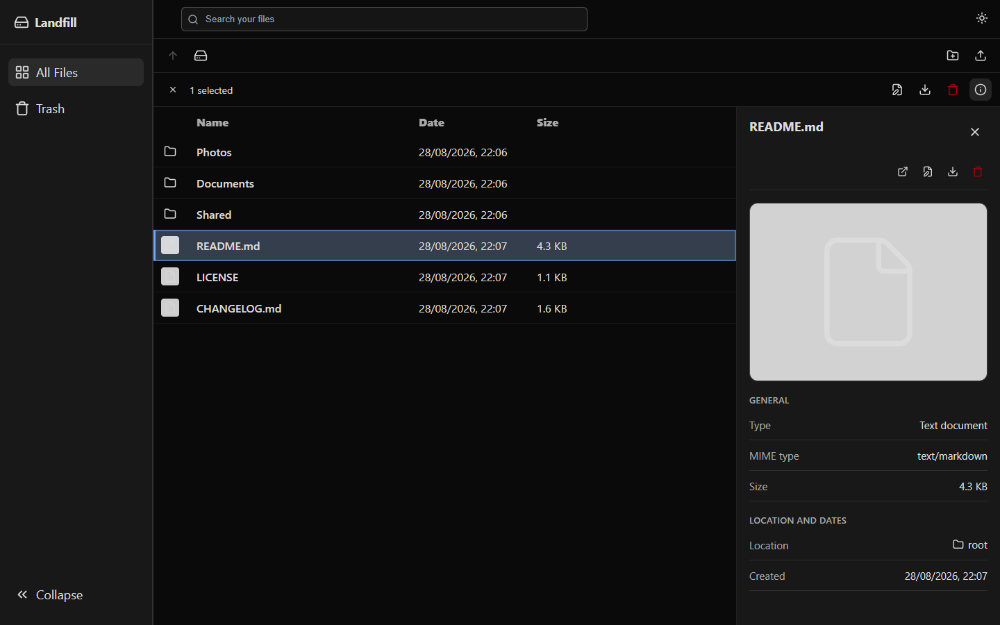

# Landfill

Landfill is a small, self-hosted file drop and browser. It gives one person one
place to upload, organize, preview, find, and retrieve files through a browser.



## What it does

- Upload multiple files or drag them directly into a folder.
- Create and browse nested folders.
- Search files and folders by name.
- Preview images, PDFs, audio, and video in the browser.
- Rename files and folders.
- Download one file directly or prepare a ZIP from several items or folders.
- Move items to trash, restore them, or delete them permanently.
- Store metadata in SQLite and file contents on disk under one data directory.
- Protect the instance with one local owner password.

Landfill deliberately targets a small single-instance installation. It is not
a Dropbox replacement or collaboration suite.

## Quick start with Docker

Requirements: Docker with Compose support.

Optionally copy the root `.env.example` to `.env` to persist the published port
and network binding. The example remains localhost-only; set
`LANDFILL_BIND_ADDRESS=0.0.0.0` only for a trusted local network.

```sh
docker compose up --build
```

Open <http://127.0.0.1:8080>. The database and uploaded files persist in the
`landfill-api` Docker volume when the containers stop.

On the first start, find the one-time owner setup code in the API logs:

```sh
docker compose logs api
```

Enter that code in the browser and choose an owner password of at least 12
characters. The code is valid only until setup succeeds or the API restarts.

To use another local port:

```sh
LANDFILL_PORT=9000 docker compose up --build
```

PowerShell:

```powershell
$env:LANDFILL_PORT = "9000"
docker compose up --build
```

Stop Landfill without deleting its data:

```sh
docker compose down
```

Do not add `-v` unless you intend to permanently delete Landfill's database and
stored files.

### Upgrading from v0.1

Back up the `landfill-api` volume before upgrading. Then pull the new version
and rebuild the containers:

```sh
docker compose down --remove-orphans
docker compose up --build -d --remove-orphans
```

Do not add `-v`: v0.2 automatically migrates the existing database in the
`landfill-api` volume and preserves its files. After the upgrade, read the
one-time setup code from `docker compose logs api` and create the owner
password. Existing files are not changed by owner setup.

## Security model

Landfill v0.2 has one local owner account. There are no usernames, invitations,
sharing accounts, or password-reset emails. The owner password is scrypt-hashed
in SQLite. Browser sessions use random tokens; only their SHA-256 hashes are
stored. Sessions expire after seven idle days or 30 days total.

The session cookie is HttpOnly and SameSite=Strict. Landfill also rejects
browser mutations whose `Origin` does not match the request host and throttles
failed setup and sign-in attempts. The health endpoint and the endpoints needed
to set up or sign in are the only public API endpoints.

Docker binds to `127.0.0.1` by default. Built-in authentication protects the
files, but the default site uses plain HTTP and does not encrypt traffic.

For an explicitly trusted private network, set `LANDFILL_BIND_ADDRESS=0.0.0.0`
before starting Compose. Use a private VPN or an HTTPS reverse proxy for access
across untrusted networks; do not expose the default HTTP listener directly to
the public internet.

`TRUST_PROXY` is the number of trusted reverse-proxy hops in front of the API.
Compose sets it to `1` for its bundled Caddy proxy. `COOKIE_SECURE=auto` marks
cookies secure when Express sees an HTTPS request. If TLS terminates in another
proxy and HTTPS is not forwarded all the way to Express, explicitly set
`COOKIE_SECURE=true` and configure that proxy to send the original scheme.

### Owner password recovery

If the owner password is lost, reset only the credentials and sessions. Files
and folders are not removed:

```sh
docker compose exec api npm run auth:reset --workspace @landfill/api -- --yes
docker compose restart api
docker compose logs api
```

The reset command is intentionally available only on the host. After the API
restarts, use the newly printed setup code in the browser and choose a new
password. Anyone with access to run commands inside the API container already
has administrative access to Landfill's data.

## Data and backups

The API stores all mutable state below `DATA_DIR`:

```text
DATA_DIR/
  database/
    main.db
    main.db-wal
    main.db-shm
  storage/
    uploads/
    downloads/
```

For a consistent backup, stop Landfill and copy the complete data directory.
Restore by putting that directory back in the same location before starting the
same or a newer Landfill version.

For Docker installations, archive the named volume while the containers are
stopped. Uploaded files and the SQLite database must always be backed up and
restored together.

## Local development

Requirements: Node.js 22.12 or newer and npm 10.9.2 or compatible.

```sh
npm ci
```

Copy the example environment files:

```text
apps/api/.env.example -> apps/api/.env
apps/web/.env.example -> apps/web/.env
```

Then run both development services:

```sh
npm run dev
```

Open <http://localhost:5173>. Vite proxies same-origin `/api` requests to the
API target configured in `apps/web/.env`. The API terminal prints the initial
owner setup code.

Useful checks:

```sh
npm test
npm run check-types
npm run lint
npm run build
```

The API smoke test creates an isolated temporary data directory and exercises
owner setup, session security and persistence, recovery, folder creation,
upload, search, rename, archive download, trash, and restore through real HTTP
requests.

## Architecture

```text
Browser
  -> React + Vite static client
  -> same-origin /api
  -> Express API
       -> owner password + server-side sessions
       -> SQLite metadata
       -> disk-backed uploads and generated ZIP files
```

The npm workspace layout is:

```text
apps/web      React, React Router, TanStack Query
apps/api      Express, Multer, Sharp, Archiver
packages/db   Drizzle schema and bundled SQLite migrations
infra/caddy   Production static hosting and /api reverse proxy
```

Archive downloads run one at a time inside the API process. Their inputs and
status live in SQLite, allowing pending work to resume after a restart without
requiring a separate queue service.

## Current limitations

- One owner only; no multi-user accounts, sharing, or per-folder permissions.
- No bundled TLS or direct public-internet deployment support.
- No sharing links.
- No storage quotas or duplicate-content detection.
- Docker Compose is the supported packaged installation; native installers are
  not currently planned for v0.2.

## License

Landfill is available under the [MIT License](LICENSE).
