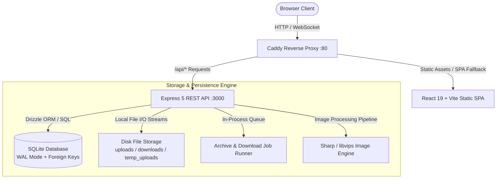
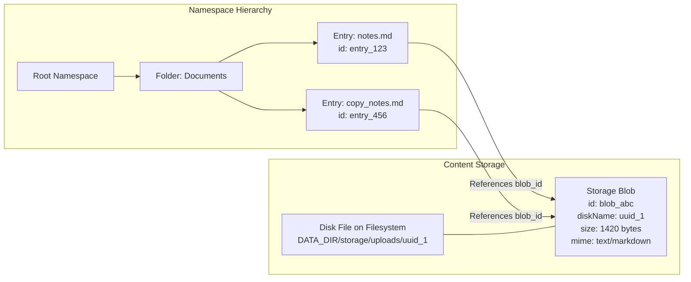
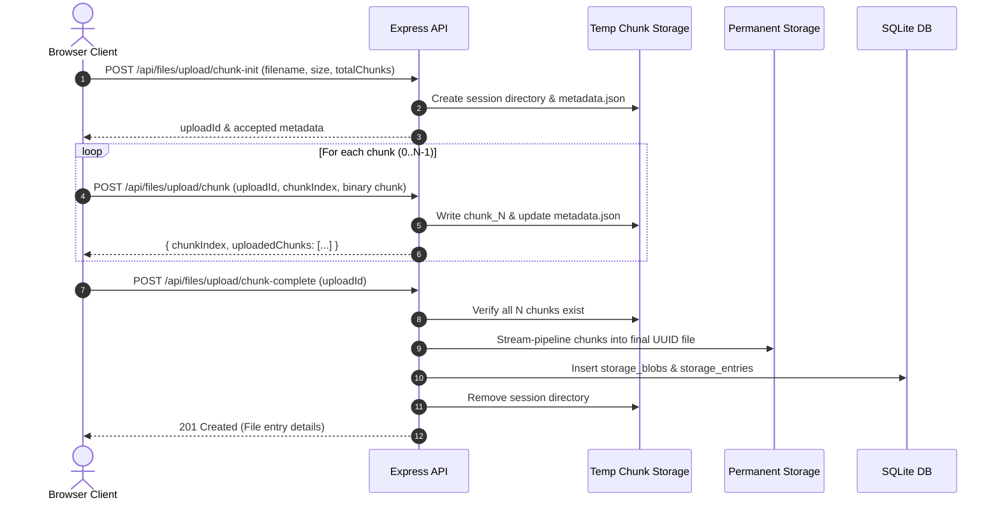

# System Architecture & Design Philosophy

This document outlines the architectural decisions, storage model, component interactions, and data flow pipelines that power **Landfill**.

---

## 1. High-Level System Overview

Landfill is built as a self-contained, single-tenant personal drive and file workbench. It avoids heavy external service dependencies (such as Redis, message brokers, or separate microservices) by utilizing an in-process worker model backed by SQLite in Write-Ahead Logging (WAL) mode.



### Monorepo Structure

The project is structured as an npm workspace orchestrated by **Turborepo**:

| Package / App       | Path          | Technologies                                                             | Responsibility                                                                                                               |
| :------------------ | :------------ | :----------------------------------------------------------------------- | :--------------------------------------------------------------------------------------------------------------------------- |
| **`@landfill/web`** | `apps/web`    | React 19, TypeScript, Vite, TanStack Query, React Router 7, Lucide Icons | Client-side Single Page Application (SPA), responsive UI, preview overlays, media players, Text Lab & Image Lab workbenches. |
| **`@landfill/api`** | `apps/api`    | Node.js 22, Express 5, Multer, Sharp, Archiver, TypeScript               | REST API endpoints, session authentication, multipart/chunked upload ingest, zip archive jobs, image transform engine.       |
| **`@landfill/db`**  | `packages/db` | Drizzle ORM, Better-SQLite3, TypeScript                                  | Relational schema definitions, SQLite pragmas, and bundled automated migration engine.                                       |
| **`infra/caddy`**   | `infra/caddy` | Caddy 2 Alpine                                                           | Production edge server: reverse proxies `/api/*` to Node.js and serves SPA static bundles with HTML5 routing fallback.       |

---

## 2. Decoupled Storage Engine: Blobs vs. Entries

A central architectural decision in Landfill is the complete decoupling between the **hierarchical namespace tree** and the **physical content storage**.



### `storage_entries` (The Namespace Layer)

- Models the virtual file system tree (`folders` and `files`).
- Manages hierarchies via parent pointers (`parent_id`).
- Handles user-facing metadata: display name, created timestamp, updated timestamp, soft-delete (`deleted_at`) timestamp, and parent inheritance.
- File entries link to `storage_blobs` via a foreign key `blob_id`.

### `storage_blobs` (The Content Layer)

- Models immutable content payloads on disk.
- Tracks physical disk filenames (UUIDv4), byte sizes, MIME types, and creation timestamps.
- Completely agnostic to folder structure or user-assigned filenames.

### Architectural Benefits:

1. **Zero-Copy File Operations**: Renaming, moving across folders, or soft-deleting files never requires touching or moving bytes on disk.
2. **Instant Versioning & Mutations**: Updating file contents in the Text Lab creates a new `storage_blob` record and updates the `entry.blob_id` pointer atomically without mutating or corrupting in-flight reads.
3. **Foundation for Content Deduplication**: Future enhancements can compute cryptographic content hashes (SHA-256) and point multiple duplicate uploads to the same underlying physical blob on disk.

---

## 3. Database Schema & Relational Design

The SQLite relational database runs with `PRAGMA foreign_keys = ON` and `PRAGMA journal_mode = WAL`.

```
┌─────────────────────────┐       ┌─────────────────────────┐
│     owner_credentials   │       │      auth_sessions      │
├─────────────────────────┤       ├─────────────────────────┤
│ PK  id (integer)        │       │ PK  token_hash (text)   │
│     password_hash (text)│       │     created_at (ms)     │
│     created_at (ms)     │       │     last_seen_at (ms)   │
│     updated_at (ms)     │       │     expires_at (ms)     │
└─────────────────────────┘       │     absolute_expires (ms│
                                  └─────────────────────────┘

┌───────────────────────────────────────────────────────────┐
│                      storage_entries                      │
├───────────────────────────────────────────────────────────┤
│ PK  id (text / uuid)                                      │
│     type (enum: 'file', 'folder')                         │
│     name (text)                                           │
│ FK  parent_id (references storage_entries.id ON DELETE)   │
│ FK  blob_id (references storage_blobs.id)                │
│     deleted_at (ms timestamp, nullable)                  │
│     created_at (ms timestamp)                             │
│     updated_at (ms timestamp)                             │
└───────────────────────────────────────────────────────────┘
               │                                │
               │ (if type='file')               │ (if type='folder')
               ▼                                ▼
┌─────────────────────────┐       ┌─────────────────────────┐
│      storage_blobs      │       │     Child Entries       │
├─────────────────────────┤       │  (Self-referential FK)  │
│ PK  id (text / uuid)    │       └─────────────────────────┘
│     disk_name (text)    │
│     size (integer)      │
│     mime_type (text)    │
│     created_at (ms)     │
└─────────────────────────┘

┌─────────────────────────┐       ┌─────────────────────────┐
│      download_jobs      │       │    download_job_item    │
├─────────────────────────┤       ├─────────────────────────┤
│ PK  id (text / uuid)    │1     N│ PK  id (text / uuid)    │
│     status (enum)       │───────│ FK  job_id (references) │
│     file_name (text)    │       │ FK  entry_id (references│
│     progress (integer)  │       └─────────────────────────┘
│     error_message (text)│
│     expires_at (ms)     │
│     created_at (ms)     │
└─────────────────────────┘
```

### Soft-Deletion and Active-Tree Inheritance Rules

- Deleting an entry sets its `deleted_at` timestamp rather than removing the row.
- The `isFolderInActiveTree` and `trash-visibility` engine verifies that an item is considered active **only if neither it nor any of its ancestor folders** have a `deleted_at` timestamp.
- When an ancestor folder is trashed, all descendant files and subfolders are automatically hidden from the active explorer without needing recursive database updates.
- Restoring a folder makes the entire subtree active again immediately.

---

## 4. Ingest & Upload Pipelines

Landfill supports three ingestion workflows designed for different file sizes and user scenarios:

### 1. Standard Multipart Upload

- **Target**: Small to medium files (< 50MB) or batch uploads of multiple files simultaneously.
- **Mechanism**: Standard `multipart/form-data` handled by `multer`. Files are streamed directly to `DATA_DIR/storage/uploads/` with UUID names, and database entries are committed within a single transaction.

### 2. Resumable Chunked Upload Engine

- **Target**: Large files (ISOs, video footage, multi-gigabyte archives) or unreliable network connections.
- **Slicing**: The client automatically slices large files into 5MB chunks.
- **Workflow**:
  1. `POST /api/files/upload/chunk-init`: Initializes an upload session in `DATA_DIR/storage/temp_uploads/<uploadId>/` with a `metadata.json` manifest.
  2. `POST /api/files/upload/chunk`: Sends individual chunk slices. Each chunk is safely stored and recorded in `uploadedChunks`.
  3. `GET /api/files/upload/status/:uploadId`: Allows resuming an interrupted transfer by querying which chunk indices are already present on the server.
  4. `POST /api/files/upload/chunk-complete`: Server verifies all chunks (0 to `totalChunks - 1`), streams and concatenates them sequentially via Node.js pipelines into a final file, computes file statistics, creates the database record, and cleans up the temporary chunk session directory.



### 3. Clipboard Ingestion (`Ctrl+V` / `Cmd+V`)

- **Target**: Screenshots directly from OS clipboard or raw text/code snippets.
- **Mechanism**: Frontend listener on the root explorer detects image or text clipboard payloads:
  - **Image**: Converts `image/png` or `image/jpeg` clipboard blobs into a timestamped file (e.g., `screenshot-2026-09-06-220000.png`) and sends it to the upload queue.
  - **Text**: Detects Markdown or plain text, prompts or auto-names as `clipboard-note-*.md`, and saves it directly to the active folder.

---

## 5. In-Process Asynchronous Job Queue

For batch downloads and folder zip generation, Landfill features an asynchronous, persistent job runner:

1. **Job Registration**: When the user requests a download of a folder or multiple files, the client sends `POST /api/downloads` with the item IDs.
2. **Database Record**: A `download_jobs` record is created in SQLite (`status: 'pending'`) alongside `download_job_item` links.
3. **Sequential Execution**: An in-memory queue (`queueTail` promise chain) processes one archive job at a time, preventing CPU and memory spikes on small home servers.
4. **Crash Resumption**: On API startup, `resumeInterruptedArchiveJobs()` scans SQLite for any jobs left in `pending` or `processing` states and enqueues them automatically.
5. **Streaming Zip Assembly**: Uses `archiver` to stream directory contents and files into a compressed `.zip` under `DATA_DIR/storage/downloads/`, tracking compression progress in SQLite.
6. **Automatic Cleanup**: Completed archive files are set with an `expiresAt` timestamp (24 hours) and periodically cleaned up by background maintenance.

---

## 6. Image Processing Engine (Image Lab)

The Image Lab provides on-the-fly previews and non-destructive exports powered by **Sharp (libvips)**:

- **Source Immutability**: The original file blob is never overwritten by transformations.
- **Pipeline Operations**:
  - Resizing (width, height, fit modes: cover, contain, fill, inside, outside).
  - Rotation (90, 180, 270 degrees).
  - Format conversions (JPEG, PNG, WebP) with configurable quality and compression levels.
- **Fast Preview Pipeline**: Renders in-memory scaled down previews without writing intermediate files to disk.
- **Export Pipeline**: Writes a new physical blob to disk and inserts a new sibling entry (e.g. `image_transformed.webp`) in the same or target folder.

---

## 7. ZIP Inspection & Extraction (Archive Lab)

Archive Lab reads ZIP central-directory metadata lazily with `yauzl`, allowing the web client to display a complete archive tree without first unpacking the file. Individual members are streamed directly from the source ZIP for download.

Extraction is staged into generated UUID disk files and registered in one SQLite transaction. The operation creates a new collision-safe root folder in the selected destination, recreates the selected directory hierarchy, and then inserts the associated `storage_blobs` and `storage_entries`. If streaming or registration fails, staged disk files are removed.

Entry paths are normalized before display or extraction. Absolute paths, parent traversal, empty paths, symbolic links, encrypted members, unsupported compression methods, and archives exceeding the entry limit are rejected or marked unsupported before storage is mutated.

The **Create ZIP** action reuses the asynchronous download-job pipeline. Once compression finishes, the API copies the prepared archive into permanent upload storage and registers it as a regular `application/zip` blob and file entry in the chosen folder.

---

## 8. Capability Modules and Routed Workspaces

Landfill is deployed as a modular monolith. Drive core owns authentication, the namespace, immutable blobs, and transactional writes. Format-specific modules own inspection and transformation rules. Archive and Image code obtain content through the Drive application boundary rather than querying storage tables or constructing physical paths themselves. Archive extraction likewise submits a staged file tree to Drive core for registration.

The web application composes file support through a static capability registry. A capability declares its file matcher, optional preview renderer, optional lazy-loaded workspace, command metadata, and any custom default-open behavior. The Explorer consumes these declarations without importing individual Labs. Image, Text, and Archive workspaces are independently split browser chunks hosted by stable routes:

```text
/labs/image/:fileId
/labs/text/:fileId
/labs/archive/:fileId
```

This is a plugin boundary within one trusted build. It provides independent feature ownership and code splitting without runtime remote-code loading or separate service operations.

### Archive Virtual Filesystem

Opening a ZIP navigates to `/archive/:fileId/*`. The archive provider converts normalized ZIP paths into read-only virtual Explorer items and synthesizes directory nodes when the ZIP has no explicit directory record. These nodes are not inserted into `storage_entries`; extraction is the operation that materializes them in the Drive namespace.

Archive indexes are cached by immutable `storage_blobs.id`. Member content URLs include that revision identifier, and the API rejects a stream if the file entry points to a different blob by the time it is opened. Entry-count, expanded-size, individual-size, compression-ratio, path, encryption, and symbolic-link checks protect browsing and extraction.
